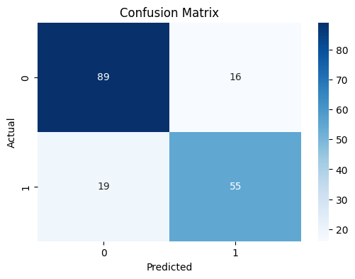
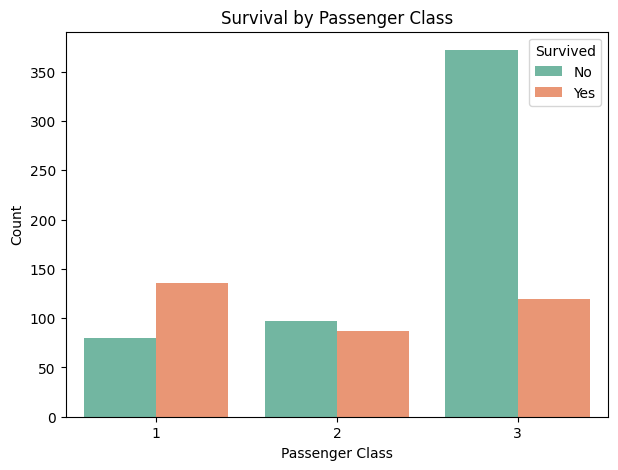

# 🛳 Titanic Survival Prediction

A machine learning pipeline project using the Titanic dataset to predict survival of passengers. The dataset is cleaned, preprocessed, visualized, and modeled using Logistic Regression.

---

## 📁 Folder Structure

├── data/
│ └── train.csv
├── notebooks/
│ └── 01_data_preprocessing.ipynb
├── visualizations/
│ ├── classification_report.png
│ ├── confusion_matrix.png
│ ├── survival_by_class.png
│ ├── survival_by_gender.png
│ └── survival_pie_chart.png
├── README.md
├── requirements.txt
└── .gitignore

yaml
Copy
Edit

---

## 📊 Visualizations

### 🎯 Overall Survival Distribution


### 🧮 Confusion Matrix Heatmap



### 📋 Classification Report


### 👩‍🚢 Survival by Gender


### 🛳 Survival by Passenger Class



---

## 🧠 ML Model

- **Model**: Logistic Regression
- **Accuracy**: ~80%
- **Evaluation**: Classification report and confusion matrix
- **Preprocessing**:
  - Handling missing values
  - Label and one-hot encoding
  - Feature scaling
  - Dropping irrelevant columns

---

## 📦 Requirements

Install dependencies using:

```bash
pip install -r requirements.txt
🔧 How to Run
Clone the repo

Navigate to the folder

Open the 01_data_preprocessing.ipynb notebook

Run all cells

✍️ Author
Hanzala Naseer
```
